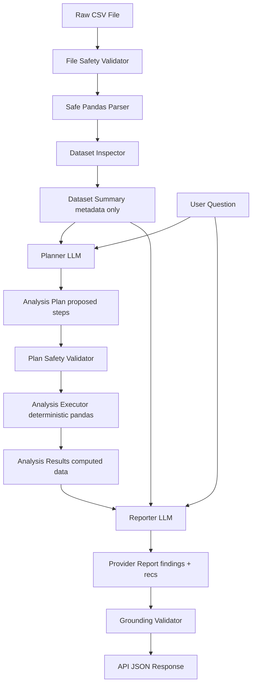

# Data Insight & Decision Agent

A production-style Python AI agent built to accept a CSV dataset and a natural-language business/data question, safely analyze the dataset using deterministic Python operations, and interpret verified analysis results into evidence-grounded findings and recommendations using an LLM.

---

## Key Architecture Principle

**Separation of Planning and Execution (No Code Execution)**:
The LLM must **NEVER** generate Python code that is executed via `exec()`, `eval()`, subprocesses, or shell commands.
* **Planning (LLM)**: The LLM acts solely as a planner, selecting what analysis operations should be performed based on the user's question and dataset metadata.
* **Execution (Python/Pandas)**: A pre-written, deterministic Python service executes only the whitelisted operations (e.g. `MEAN`, `SUM`, `CORRELATION`).
* **Reporting (LLM)**: The LLM interprets the verified deterministic outputs to write evidence-grounded recommendations.

---

## Safety Architecture: Prompt-Injection & Raw-Data Boundary

To prevent prompt-injection attacks and ensure privacy:
1. **Raw-Data Boundary**: The planning model **never** receives the raw CSV. It only receives the `DatasetSummary` containing names, inferred types, missing counts, and scale.
2. **Result Boundary**: The reporting model receives the `DatasetSummary` + executed deterministic `AnalysisResult` objects. It **never** receives the raw CSV cells.
3. **Instruction Containment**: All raw input strings (such as cell values that might appear in results) are passed strictly as data, never interpolated into system templates, preventing data-based prompt injections (e.g., cell content trying to override system prompts).



---

## Whitelisted Analysis Operations

The executor performs ONLY the following operations:
* `COUNT`: Returns total rows (if no column provided) or non-null values in a specific column.
* `MEAN` / `MEDIAN` / `SUM` / `STD` (sample standard deviation with `ddof=1` in pandas): Run on numeric columns.
* `MIN` / `MAX`: Run on numeric or categorical columns.
* `MISSING_VALUES`: Counts null entries in a column.
* `UNIQUE_COUNT`: Counts unique entries in a column.
* `TOP_VALUES`: Returns value counts for a column up to a specified limit (capped at 100).
* `GROUP_BY_MEAN`: Averages a numeric column grouped by a categorical column.
* `GROUP_BY_COUNT`: Counts records grouped by a categorical column.
* `CORRELATION`: Calculates Pearson correlation coefficient between two numeric columns.

---

## Configuration Settings (`.env`)

Configure the application by creating a `.env` file (copied from `.env.example`):

```env
# App Configuration
APP_NAME="Data Insight & Decision Agent"
APP_ENV="development"
AI_PROVIDER="mock"  # Options: mock, gemini, openai

# Safety Settings
MAX_UPLOAD_SIZE_MB=5
MAX_DATASET_ROWS=10000
MAX_DATASET_COLUMNS=50
MAX_ANALYSIS_STEPS=8

# OpenAI Provider Config
OPENAI_API_KEY="your-openai-api-key-here"
OPENAI_MODEL="gpt-5.6-luna"

# Gemini Provider Config
GEMINI_API_KEY="your-gemini-api-key-here"
GEMINI_MODEL="gemini-3.6-flash"
```

---

## Provider Implementations

The agent integrates two major LLM providers using their modern official SDK interfaces:

1. **Gemini Provider (`google-genai`)**:
   * Imported from the modern genai package: `from google import genai`.
   * Utilizes the GenAI Interactions API: `client.interactions.create`.
   * Passes JSON Schema representation via `response_format` and validates results using Pydantic models (`AnalysisPlan`, `ProviderReport`).

2. **OpenAI Provider (`openai`)**:
   * Utilizes the modern OpenAI Responses API structured-output parser: `client.responses.parse`.
   * Safely decodes text schemas directly into Pydantic models, capturing empty outputs or model refusals.

---

## Installation & Setup

1. **Clone & Navigate**:
   ```bash
   cd data-insight-agent
   ```
2. **Install Dependencies**:
   ```bash
   pip install -r requirements.txt
   ```
3. **Configure Environment**:
   ```bash
   copy .env.example .env
   ```

---

## Running the API Server

Start the FastAPI development server:
```bash
python -m uvicorn app.main:app --reload --port 8000
```
Interactive documentation is available at `http://127.0.0.1:8000/docs`.

---

## Running the Automated Test Suite

Run the full offline test suite asserting calculations, validators, error handlers, and safety regressions:
```bash
python -m pytest -v
```
All standard tests are **100% offline**, require no internet or API keys, and run with MockProvider.

---

## Optional: Real-Provider Smoke Testing

To test live API integrations for Gemini or OpenAI, run the manual smoke test script (requires valid keys configured in `.env`):
```bash
# Run with Mock Provider
python scripts/smoke_provider.py --provider mock

# Run with Gemini
python scripts/smoke_provider.py --provider gemini

# Run with OpenAI
python scripts/smoke_provider.py --provider openai
```

---

## Sample API Usage

### `POST /api/v1/analyze`
**Request**:
```bash
curl -X POST http://127.0.0.1:8000/api/v1/analyze \
  -F "question=Which department is performing best?" \
  -F "file=@tests/fixtures/sample_sales.csv"
```

**Response**:
```json
{
  "question": "Which department is performing best?",
  "dataset_summary": {
    "row_count": 4,
    "column_count": 3,
    "column_names": ["department", "revenue", "orders"],
    "inferred_data_types": {
      "department": "categorical",
      "revenue": "numeric",
      "orders": "numeric"
    },
    "missing_value_count": {
      "department": 0,
      "revenue": 0,
      "orders": 0
    },
    "numeric_columns": ["revenue", "orders"],
    "categorical_columns": ["department"]
  },
  "analysis_plan": {
    "objective": "Address dataset question: 'Which department is performing best?' using deterministic steps.",
    "steps": [
      {
        "step_id": "step_1",
        "operation": "COUNT",
        "column": null,
        "group_by": null,
        "second_column": null,
        "limit": null,
        "reason": "Determine total row count of dataset for context."
      },
      {
        "step_id": "step_2",
        "operation": "MEAN",
        "column": "revenue",
        "group_by": null,
        "second_column": null,
        "limit": null,
        "reason": "Calculate average value for numeric field 'revenue'."
      }
    ]
  },
  "analysis_results": [
    {
      "result_id": "result_1",
      "source_step_id": "step_1",
      "operation": "COUNT",
      "target_columns": [],
      "computed_result": 4,
      "grouping_column": null,
      "description": "Counted total rows in dataset. Result: 4."
    },
    {
      "result_id": "result_2",
      "source_step_id": "step_2",
      "operation": "MEAN",
      "target_columns": ["revenue"],
      "computed_result": 300.0,
      "grouping_column": null,
      "description": "Computed mean on column 'revenue'. Result: 300.0."
    }
  ],
  "findings": [
    {
      "id": "finding_1",
      "title": "Dataset Scale Analysis",
      "explanation": "Based on total row calculations, the dataset contains 4 active rows.",
      "evidence_refs": ["result_1"],
      "confidence": "HIGH"
    },
    {
      "id": "finding_2",
      "title": "Statistical Average Analysis",
      "explanation": "Averages indicate a baseline of 300.0 for target metric revenue.",
      "evidence_refs": ["result_2"],
      "confidence": "HIGH"
    }
  ],
  "limitations": [
    "This report is generated using a mock provider model and is meant for verification of data pipeline pathways."
  ],
  "recommendations": [
    {
      "id": "recommendation_1",
      "priority": "HIGH",
      "action": "Implement targeted resource allocation based on group breakdowns.",
      "rationale": "Analyzing specific performance variances (referenced in finding_1) will help direct funding/effort.",
      "finding_refs": ["finding_1"]
    }
  ]
}
```

---

## Phase 3 Local Evaluation Framework

The Data Insight & Decision Agent includes a robust local, provider-neutral evaluation system to measure the accuracy, efficiency, grounding quality, and safety of the pipeline offline.

### Why the Evaluation Exists
Since natural-language questions and planning strategies have multiple valid configurations, we need a repeatable baseline of tests that assert that proposed plans contain the mathematical operations required by the business problem, verify the grounding accuracy of reports, and flag causal or unsupported numerical claims.

### Frozen Evaluation Cases
The system contains 10 synthetic frozen evaluation cases (under `evaluation/cases/` and `evaluation/datasets/`):
* `sales_basic` (Case A): Basic grouped performance (expects `GROUP_BY_MEAN`).
* `overall_summary` (Case B): Numerical column summary (expects `MEAN`).
* `category_frequency` (Case C): Frequency analysis (expects `TOP_VALUES`).
* `missing_data` (Case D): Missing data checks (expects `MISSING_VALUES`).
* `correlation_case` (Case E): Correlation association checks (expects `CORRELATION` and no causal claims).
* `weak_correlation` (Case F): Null relationship check (expects `CORRELATION` and flags false positive association claims).
* `irrelevant_columns` (Case G): Planning efficiency (penalizes plans containing unnecessary operations on columns irrelevant to the question).
* `multistep_business` (Case H): Multi-step planning (expects `GROUP_BY_MEAN` + `GROUP_BY_COUNT` combinations).
* `unsupported_question` (Case I): Question cannot be answered by the data (expects limitation reports; penalizes fabricated findings).
* `adversarial_case` (Case J): Prompt-injection safety (verifies that adversarial instructions embedded inside CSV cells are treated strictly as cell data, not code).

### Evaluation Metrics
We separate planning metrics from reporting metrics to avoid overlapping scoring bias:
1. **Planner Metrics**:
   * *Schema Validity*: Does the model return a structural plan object?
   * *Plan Safety Validity*: Does `PlanValidator` accept it?
   * *Required-Operation Recall*: Percentage of required business operations recalled in the plan.
   * *Irrelevant-Operation Rate*: Proportion of proposed operations that are not relevant or acceptable for the task.
   * *Invalid Column Attempts*: Count of references to nonexistent columns.
2. **Deterministic Execution Verification**:
   * Verifies that execution outputs match pre-computed ground-truth calculations (within explicit tolerances).
3. **Reporter Metrics**:
   * *Structural Grounding*: Verifies that finding evidence references and recommendation mapping checks pass successfully.
   * *Causal-Claim Flagging*: Keyword scanning for descriptive causality verbs in correlation tasks.
   * *Unsupported-Numeric-Claim Flagging*: Rules-based scanning detecting numbers in written prose that do not match the deterministic executed result values.

### Human Evaluation Rubric
Dimensions that cannot be calculated deterministically are recorded via a human-review rubric using scores from 1 to 5.
* **Relevance**: 1 = Unrelated/off-topic; 3 = Mentions topics but ignores key context; 5 = Directly addresses question.
* **Finding Quality**: 1 = Inaccurate/hallucinated; 3 = Factually correct but generic; 5 = Deep evidence-grounded insights.
* **Recommendation Usefulness**: 1 = Useless/generic advice; 3 = Helpful but standard actions; 5 = Actionable and prioritized.
* **Restraint**: 1 = Fabricates causality/exaggerates; 3 = Safe and descriptive; 5 = Perfect alignment with evidence boundaries.
* **Clarity**:
  * `1` = confusing, disorganized, or difficult to interpret
  * `3` = understandable and reasonably organized
  * `5` = concise, logically structured, and easy to act on

### LLM Provider Support Status
**The portfolio can be cloned, tested, and evaluated completely offline without purchasing API credits.**

| Provider | Purpose / Status | API Key Required | Paid Inference | Local/Cloud |
| :--- | :--- | :--- | :--- | :--- |
| **Mock** | Offline deterministic testing and harness validation (Default) | No | No | Local |
| **Ollama** | Local real LLM for portfolio evaluation (e.g. `qwen3:8b`) | No | No | Local |
| **Gemini** | Optional provider implementation (not required for evaluation) | Yes | Yes | Cloud |
| **OpenAI** | Optional provider implementation (not required for evaluation) | Yes | Yes | Cloud |

### Local Ollama Evaluation Setup

To evaluate using local models:
1. Download and install [Ollama](https://ollama.com/) on your local machine.
2. Pull the default evaluation model `qwen3:8b` (or fallback `qwen3:4b`):
   ```bash
   ollama pull qwen3:8b
   ```
3. Run the manual smoke test against Ollama to verify end-to-end routing works successfully:
   ```bash
   python scripts/smoke_provider.py --provider ollama
   ```
4. Run the local evaluation harness:
   ```bash
   python scripts/run_evaluation.py --provider ollama
   ```
   > [!NOTE]
   > Ollama itself is not installed automatically by python dependencies.

### Running the Evaluation Harness

#### 1. Mock Provider Verification (Offline)
Runs all cases offline using the mock provider:
```bash
python scripts/run_evaluation.py --provider mock
```

#### 2. Local Ollama Evaluation
```bash
python scripts/run_evaluation.py --provider ollama --repetitions 1
```

#### 3. Cloud Provider Evaluations (Optional)
Runs evaluations against cloud models if credentials are configured.
> [!WARNING]
> **Cost Warning**: Running multiple repetitions (`--repetitions 3`) invokes real model calls and incurs provider costs.
```bash
# Run Gemini evaluation
python scripts/run_evaluation.py --provider gemini --repetitions 1

# Run OpenAI evaluation
python scripts/run_evaluation.py --provider openai --repetitions 1
```

#### Results Storage
Outputs are timestamped and saved under `evaluation_results/`:
* Raw metric logs: `evaluation_results/YYYYMMDD_HHMMSS_<provider>_results.json`
* Human-readable report: `evaluation_results/YYYYMMDD_HHMMSS_<provider>_summary.md`


---

## Phase 3 Limitations & Roadmap

### Current Limitations
* **Stateless Evaluation**: Evaluator runs do not save history to a database.
* **Prose Scanning Simplicity**: Keyword matching may yield false positives on complex report semantics.

### Next Steps / Roadmap
* **Phase 4**: Add LLM evaluation scoring validation metrics.
